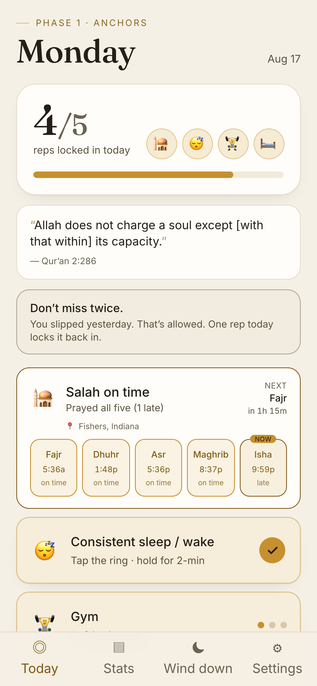
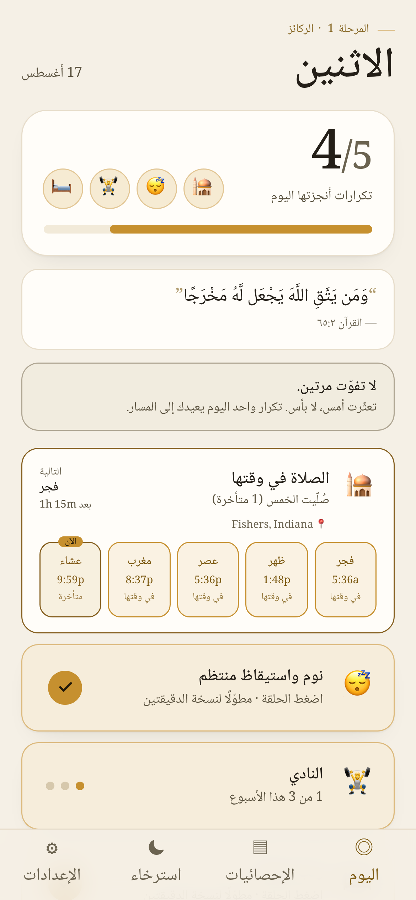
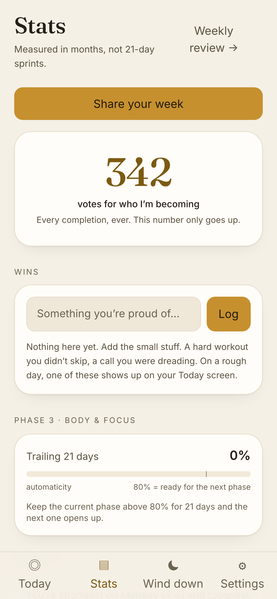

# The Rebuild

A personal, local-first habit tracker that enforces one specific discipline
system — not a generic streak app. Everything runs in your browser; there is no
account, no backend, and no data ever leaves your device (it lives in
`localStorage`, with JSON export/import for backup).

Built with **Vite + React + Tailwind v4**. Dark, mobile-first, installable as a
PWA.

## Screenshots

The Today screen in the Ivory (light) theme, the same in Arabic with full RTL
layout, and the Stats screen with streak heatmaps and phase progress.

  

<sub>Also shipped in Charcoal and four more palettes — see `screenshots/today-charcoal.png`.</sub>

## The system it enforces

The philosophy is baked into the *logic*, not just the copy:

1. **Never miss twice.** One missed day is fine; two consecutive misses is the
   failure state. The app shows them differently — a single miss triggers a
   supportive "don't miss twice" nudge, never a shame spiral.
2. **Shrink it, don't skip it.** Every habit has a 2-minute version. Logging it
   counts as a completion — a *minimum rep* (◐) vs a *full rep* (✓).
3. **No shame spirals.** A miss resets nothing but the consecutive-day count.
   Lifetime totals only ever go up.
4. **Automaticity takes ~60+ days**, so progress is measured over months
   (trailing-21-day phase completion), not 21-day challenges.

### The 5 phases

Habits are grouped into phases you unlock in order:

1. **Anchors** — Salah on time, consistent sleep/wake, gym 3×/week, make bed
2. **Mind & Structure** — plan tomorrow, Sunday plan, read, Quran, no snooze
3. **Body & Focus** — no-phone windows, deep work, water, protein, walk, tidy
4. **Money & Admin** — expenses, meal prep, chore days, 48h impulse rule
5. **Character** — adhkar, gratitude, journal, friend check-in, Mon/Thu fasting

A phase unlocks manually (you decide when it feels automatic). The app *suggests*
unlocking when the current phase is ≥80% complete over the trailing 21 days.

### Beyond the routines

Two things round out the day without touching the discipline machinery:

- **Tasks.** One-off to-dos live in a card on Today, alongside the habits.
  They're deliberately kept off the scoreboard — finishing one never affects the
  daily score, streaks, or never-miss-twice (it does count a single *vote*).
  Unfinished tasks roll quietly to the next day with a soft "since Tue" tag; the
  evening shutdown's "plan tomorrow's top 3" creates real tasks for tomorrow.
- **Daily anchor.** One quiet line of motivation, fixed for the whole day
  (deterministic by date — not a feed, no refresh button). It rotates through a
  curated set of verified quotes (with your own additions from Settings) and,
  once you've logged enough, your own past wins and journal lines — which it
  leans on during rough-day and restart states.
- **Food log.** A plain, awareness-only card on Today: type what you ate and it's
  timestamped and grouped under quiet time-of-day headers. Text only — no photos,
  calories, macros, goals, windows, or streaks, and it never touches the score.
  Frequent items become one-tap re-add chips; a day with nothing logged is
  neutral, not a warning.
- **Accountability share.** From the weekly review or Stats, turn the week into
  something you can send a friend: a plain-text summary and an ivory/gold image
  card (drawn on a canvas, no external services). Habit scores, streaks, and one
  line you type. Nothing from the private or food logs ever appears in it.

### Making it yours

- **Themes.** Six palettes (Ivory, Charcoal, Midnight, Sand, Sage, Rose) plus a
  System option that follows your device. Built on a data-driven theme system —
  a theme is one palette object — and every palette clears WCAG AA (there's a
  test). The completion glow and heatmap tint to each theme's accent.
- **Language.** English and Arabic, with real RTL layout and an Arabic Naskh
  face. Seeded from your device language, changeable in onboarding and Settings,
  and carried in the backup. Built-in habit names are stored as keys, so they
  switch language live; habits you type yourself stay exactly as written. Built
  on a lazy-loaded string table so more languages are data, not code.
- **Include Islamic practices? (Yes / No).** Asked once, early in onboarding, and
  changeable anytime in Settings. On is the full experience — the Salah card,
  Mon/Thu fasting, scripture in the Daily anchor, prayer-time setup. Off is a
  clean, universal app with all of that hidden. It's visibility-only: nothing is
  deleted, so flipping it back on restores everything with history intact. A
  central registry (`src/lib/faith.js`) is the single source of what's Islamic,
  and a CI test renders every screen in No mode and fails if any of it leaks.
- **First-run tour + calm start.** A four-step coach tour runs once after
  onboarding. New devices open to a calm screen (Tasks and Food tucked into
  one-line sections), and per-device settings remember how you like it.

## Run it

Node 20 is required (pinned in `.nvmrc`; CI uses 20).

```bash
npm install
npm run dev      # local dev server (prints a URL, open it on your phone too)
npm run build    # production build → dist/
npm run preview  # serve the production build locally
```

Open the printed URL on your phone (same Wi-Fi) and "Add to Home Screen" to use
it as an installable app.

## What's built

All the core screens are built and shipping:

- **Today** — daily score with anchor emojis, the Salah 5-prayer card, habit
  cards (tap = full rep, hold = 2-minute rep), the Daily anchor, Tasks and Food
  cards, at-risk banner, restart protocol, and rough-day / minimum-viable-day.
- **Stats** — streak heatmaps, per-habit lifetime/30-day/best, phase progress,
  the wins list, weekday insights, and a "fix a past day" editor.
- **Wind down** — the evening shutdown wizard (reflect, plan tomorrow's top
  tasks).
- **Weekly review** — score last week, pick one thing to improve, plan the week.
- **Private log** — single-owner, PIN-gated (salted SHA-256, per-device), with a
  20-minute urge timer and trigger-pattern stats.
- **Settings** — full habit editor, phase control, themes, language, the Islamic
  practices toggle, prayer location + times, day-rollover hour, and backup.
- **Accountability share** — plain-text + a canvas image card, from Stats or the
  weekly review.

Still not built: web-notification reminders (morning / 10:30pm / shutdown /
Sunday) — the service worker has the upgrade path stubbed for it.

Quality gates: `npm test` runs the unit suite (Vitest, 215 tests over the rules
engine, migrations, i18n, backup, and the faith registry). `npm run e2e` is a
headless-Chromium pass that pins the real layout — the share sheet and day
editor fit a 390px viewport, the Daily anchor stays put, and no Islamic term
leaks in No mode — and it runs in CI as a deploy gate.

## How it's organized

```
src/
  lib/
    time.js     # logical-day math — day rolls over at 3am (configurable)
    seed.js     # the system as data: all phases, habits, 2-min versions
    logic.js    # pure rules engine: streaks, never-miss-twice, phase %, MVD
    faith.js    # registry of every Islamic surface; the toggle reads only this
    migrate.js  # forward-migrate any saved state into the current shape
    backup.js   # versioned JSON export/import envelope
    anchor.js, quotes.js, share.js, prayerTimes.js, tasks.js, food.js, …
  i18n/         # en/ar string tables + stock-habit name resolver
  store.jsx     # single localStorage-backed state + intent-named actions
  components/   # HabitCard, SalahCard, ShareSheet, DayEditor, AnchorCard, …
  screens/      # Today, Stats, Shutdown, WeeklyReview, Private, Settings, Welcome
  App.jsx       # shell + bottom nav
scripts/e2e/    # viewport.mjs — the headless layout / no-leak pass
public/
  manifest.webmanifest, sw.js, icons   # PWA
```

## Known limitations

Honest list, for future-me:

- **Reminders aren't built.** No morning / evening / Sunday notifications yet.
  The service worker has `push` / `notificationclick` stubs noted but unwired.
- **Two languages.** English and Arabic only. The engine is data-driven, but
  every other language is still untranslated (falls back to English).
- **Prayer times need a network fetch once.** They come from the AlAdhan API and
  are cached to localStorage for offline use; the very first load per location
  needs a connection (a manual fallback exists in Settings).
- **The E2E is layout/leak-focused, not a full functional suite.** It guards
  viewport fit, anchor position, and the faith no-leak rule; it doesn't yet
  assert every interaction.
- **Cache bloat over time.** The service worker keeps old fingerprinted assets in
  its runtime cache across many deploys (correctness is fine — HTML is
  network-first — but Cache Storage grows slowly).
- **Dependencies are a major version behind** (React 18, Vite 6) by choice; no
  known vulnerabilities (`npm audit` is clean).

### Key model decisions

- **Logical days.** A "day" is your wall clock shifted back by the rollover hour
  (default 3am), so a 12:30am check-in still counts as *today*. All logic keys
  off `dayKeyFor()` in `lib/time.js`.
- **One state object**, persisted to `localStorage` on every change and loaded
  through `migrate()` so newly-shipped seed habits merge into old saves.
- **`votes`** (the "who I'm becoming" counter) is a monotonic counter incremented
  on each new completion and never decremented — it only goes up.

## How to add / change things

- **Add or edit a habit's data:** edit `SEED_HABITS` in `src/lib/seed.js`
  (id, emoji, phase, `frequency`, `minVersion`). New entries auto-merge into
  existing saved state via `migrate()`. There's also a full in-app habit editor
  in Settings for custom habits. If a new seed habit is an Islamic practice,
  register it in `src/lib/faith.js` or the no-leak CI test will fail.
- **Change a rule:** the rules are pure functions in `src/lib/logic.js`
  (e.g. `isMVDWin`, `riskSignals`, `phaseProgress`). Change them there and the
  whole UI follows.
- **Change the day-rollover hour:** `settings.dayRolloverHour` (Settings screen,
  or edit the exported JSON).
- **Add a screen:** drop a component in `src/screens/`, add a tab in
  `TABS` in `src/App.jsx`.

## Backup

Settings → Export downloads a JSON snapshot of everything, wrapped in a small
versioned envelope (`schemaVersion` + `exportedAt` + the state). Import unwraps
any envelope — or a legacy bare-state export — and runs it through `migrate()`,
so a backup taken today still restores cleanly after future format or data-model
changes. Restores on any device. That's your whole backup story — no cloud
required.

## Deploying (Cloudflare Pages, from a private repo)

The repo stays **private** on GitHub; **Cloudflare Pages** hosts it for free.
Live site: `https://the-rebuild.pages.dev`.

There are two ways to ship, and both are set up:

### 1. Manual, one command

```bash
npm run deploy
```

Builds the app and uploads `dist/` to the `the-rebuild` Pages project via
Wrangler (`scripts/deploy.sh`). Requires a one-time `wrangler login`.

### 2. Automatic on every push (GitHub Actions)

`.github/workflows/deploy.yml` builds and deploys to Cloudflare Pages on every
push to `main`. `.github/workflows/ci.yml` runs a build check on pull requests.

One-time setup — add a repo secret so the Action can deploy:

1. **Cloudflare dashboard → Manage Account → Account API Tokens → Create Token.**
2. Use **Create Custom Token** with permission
   **Account · Cloudflare Pages · Edit** (scoped to your account). Create it and
   copy the token.
3. In GitHub: **repo → Settings → Secrets and variables → Actions → New
   repository secret**, name it **`CLOUDFLARE_API_TOKEN`**, paste the token.

The account ID is inlined in the workflow (it's an identifier, not a secret).
After that, every push to `main` auto-deploys.

### Notes

- `base: './'` in `vite.config.js` means the app works at any path/domain.
- Node is pinned to 20 via `.nvmrc`.
- No personal data is ever in the repo or on the server — all app data lives in
  your browser's localStorage.
- To keep the *site* private, enable **Cloudflare Access** (Pages project →
  Settings) for email or one-time-PIN login.
