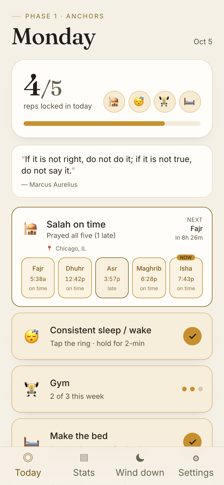
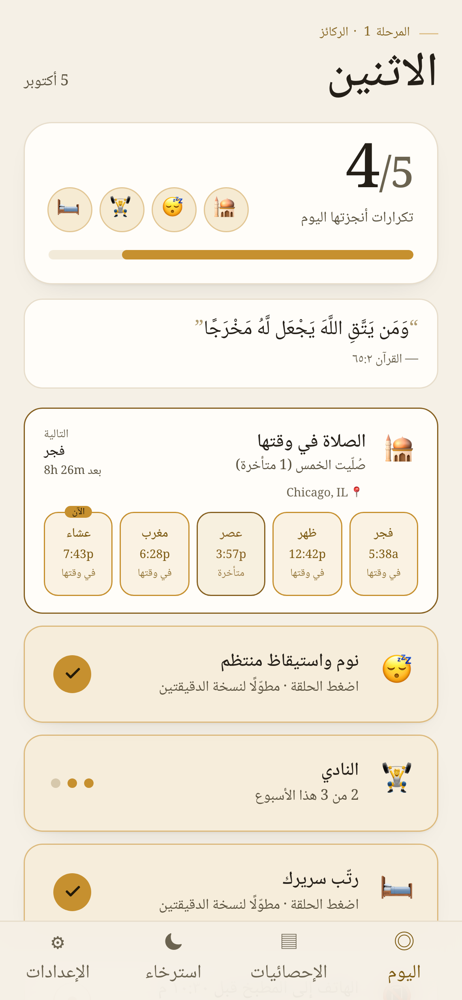
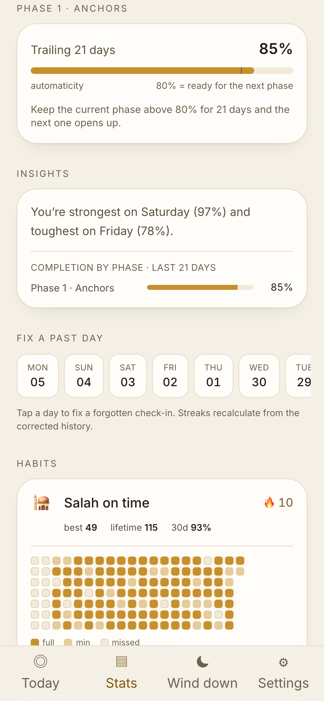

# The Rebuild

[](https://github.com/TawfiqA05/the-rebuild/actions/workflows/deploy.yml)

Live: https://the-rebuild.pages.dev

A personal, local-first habit tracker that enforces one specific discipline
system, not a generic streak app. It runs in your browser with no account and
no backend. What you log lives in `localStorage`, with JSON export/import for
backup. A few requests do go out, and I list every one under
[What leaves your device](#what-leaves-your-device).

Built with **Vite + React + Tailwind v4**. Mobile-first and installable as a
PWA. A new install follows your device: Ivory in light mode, Charcoal in dark.

## Screenshots

The Today screen in the Ivory (light) theme, the same in Arabic with full RTL
layout, and the Stats screen with streak heatmaps and phase progress.

  

<sub>Also shipped in Charcoal and four more palettes. See `screenshots/today-charcoal.png`.</sub>

## The system it enforces

The philosophy is baked into the *logic*, not just the copy:

1. **Never miss twice.** One missed day is fine; two consecutive misses is the
   failure state. The app shows them differently. A single miss triggers a
   supportive "don't miss twice" nudge, never a shame spiral.
2. **Shrink it, don't skip it.** Every habit has a 2-minute version. Logging it
   counts as a completion: a *minimum rep* (◐) vs a *full rep* (✓).
3. **No shame spirals.** A miss resets nothing but the consecutive-day count.
   Lifetime totals only ever go up.
4. **Automaticity takes ~60+ days**, so progress is measured over months
   (trailing-21-day phase completion), not 21-day challenges.

### The 5 phases

Habits are grouped into phases you unlock in order:

1. **Anchors**: Salah on time, consistent sleep/wake, gym 3×/week, make bed,
   phone to the kitchen by 10:30pm, clean feed
2. **Mind & Structure**: plan tomorrow, Sunday plan, read, Quran, no snooze
3. **Body & Focus**: no-phone windows, deep work, water, protein, walk, tidy
4. **Money & Admin**: expenses, meal prep, chore days, 48h impulse rule
5. **Character**: adhkar, gratitude, journal, friend check-in, Mon/Thu fasting

A phase unlocks manually (you decide when it feels automatic). The app *suggests*
unlocking when the current phase is ≥80% complete over the trailing 21 days.

### Beyond the routines

Two things round out the day without touching the discipline machinery:

- **Tasks.** One-off to-dos live in a card on Today, alongside the habits.
  They're deliberately kept off the scoreboard. Finishing one never affects the
  daily score, streaks, or never-miss-twice (it does count a single *vote*).
  Unfinished tasks roll quietly to the next day with a soft "since Tue" tag; the
  evening shutdown's "plan tomorrow's top 3" creates real tasks for tomorrow.
  Finished and deleted tasks wait in a searchable archive for 90 days, and you
  can bring one back from there. A task can also go on your calendar, as a
  Google Calendar link or an .ics file.
- **Daily anchor.** One quiet line of motivation, fixed for the whole day
  (deterministic by date, not a feed, no refresh button). It rotates through a
  curated set of verified quotes (with your own additions from Settings) and,
  once you've logged enough, your own past wins and journal lines, which it
  leans on during rough-day and restart states.
- **Food log.** A plain, awareness-only card on Today: type what you ate and it's
  timestamped and grouped under quiet time-of-day headers. Text only: no photos,
  calories, macros, goals, windows, or streaks, and it never touches the score.
  Frequent items become one-tap re-add chips; a day with nothing logged is
  neutral, not a warning.
- **Accountability share.** From the weekly review or Stats, turn the week into
  something you can send a friend: a plain-text summary and an image card in
  your current theme's colors (drawn on a canvas, no external services).
  Habit scores, streaks, and one line you type. Nothing from the food log ever
  appears in it.

### Making it yours

- **Themes.** Six palettes (Ivory, Charcoal, Midnight, Sand, Sage, Rose) plus a
  System option that follows your device. Built on a data-driven theme system
  (a theme is one palette object), and every palette clears WCAG AA (there's a
  test). The completion glow and heatmap tint to each theme's accent.
- **Language.** English and Arabic, with real RTL layout and an Arabic Naskh
  face. Seeded from your device language, changeable in onboarding and Settings,
  and carried in the backup. Built-in habit names are stored as keys, so they
  switch language live; habits you type yourself stay exactly as written. Built
  on a lazy-loaded string table so more languages are data, not code.
- **Include Islamic practices? (Yes / No).** Asked once, early in onboarding, and
  changeable anytime in Settings. On is the full experience: the Salah card,
  Mon/Thu fasting, scripture in the Daily anchor, prayer-time setup. Off is a
  clean, universal app with all of that hidden. It's visibility-only: nothing is
  deleted, so flipping it back on restores everything with history intact. A
  registry (`src/lib/faith.js`) lists the Islamic habits, prompts and quotes.
  Today and Settings also check the setting directly for a few lines of their
  own. A CI check opens every main screen in No mode and fails if an Islamic term
  shows up.
- **First-run tour + calm start.** A five-step coach tour runs once after
  onboarding. New devices open to a calm screen (Tasks and Food tucked into
  one-line sections), and per-device settings remember how you like it.

## What leaves your device

Your habits, logs, tasks, food entries, journal lines and settings stay in your
browser. Besides loading the app's own files from Cloudflare Pages, these are
the only requests it makes:

- **Fonts.** The app loads its fonts from Google Fonts (`fonts.googleapis.com`
  and `fonts.gstatic.com`) the first time it opens, and again after some
  updates. In between, the service worker uses the copy saved on your device.
  Google sees what any browser request carries, like your IP address, but
  nothing you've logged.
- **Prayer times.** Only with Islamic practices on and a location set. The app
  asks AlAdhan (`api.aladhan.com`) for a month of times: either the place you
  typed, or your position from "use my location" rounded to two decimals
  (about 1 km). The exact position stays saved on your device. Each month is
  cached, so it only asks again for a new month or a new place.
- **Google Calendar link.** Next to a task, the Google Calendar button opens
  Google with the task's title and due date in the link. Nothing is sent until
  you tap it. The .ics button beside it saves a file on your device and sends
  nothing.

## Run it

Node 20 is required (pinned in `.nvmrc`; CI uses 20).

```bash
npm install
npm run dev      # local dev server, on this computer only
npm run build    # production build → dist/
npm run preview  # serve the production build locally
```

The dev server only answers on this computer, so a phone can't open it as is.
Exposing it with `npm run dev -- --host` doesn't fix that: the phone gets it
over plain http, where the browser hides `crypto.subtle`, and part of the
app needs it. To use it on a phone, open the live site and choose "Add to Home
Screen".

## What's built

All the core screens are built and shipping:

- **Today**: daily score with anchor emojis, the Salah 5-prayer card, habit
  cards (tap = full rep, hold = 2-minute rep), the Daily anchor, Tasks and Food
  cards, at-risk banner, restart protocol, and rough-day / minimum-viable-day.
- **Stats**: streak heatmaps, per-habit lifetime/30-day/best, phase progress,
  the wins list, weekday insights, and a "fix a past day" editor.
- **Wind down**: the evening shutdown wizard (reflect, plan tomorrow's top
  tasks).
- **Weekly review**: score last week, pick one thing to improve, plan the week.
- **Settings**: full habit editor, phase control, themes, language, the Islamic
  practices toggle, prayer location + times, day-rollover hour, and backup.
- **Accountability share**: plain-text + a canvas image card, from Stats or the
  weekly review.

There are no reminders. The app never sends notifications.

Quality gates: `npm test` runs the unit suite (Vitest). It covers the rules
engine and streaks, migrations, backup and import, both string tables (Arabic
must have every English key, with the same placeholders), tasks and the
archive, the food log, prayer times, themes and their contrast, sharing, the
Daily anchor, the faith registry, and the store itself, mounted in jsdom.
`npm run e2e` is a headless-Chromium
pass on the built app at 390px: the share sheet and day editor fit the screen,
the Daily anchor stays put, no Islamic term shows in No mode, "use my
location" only reaches AlAdhan, the calendar buttons send nothing until you tap
them, the first-run tour works, a wrong backup file changes nothing, a failed
save shows its line, and two open tabs don't overwrite each other. The e2e
runs with the network closed: only the local preview server answers, service
workers are blocked, AlAdhan gets a made-up reply, and the run fails if any
other address gets through. Both run in CI before every deploy.

## How it's organized

```
src/
  lib/
    time.js     # logical-day math, day rolls over at 3am (configurable)
    seed.js     # the system as data: all phases, habits, 2-min versions
    logic.js    # pure rules engine: streaks, never-miss-twice, phase %, MVD
    faith.js    # registry of the Islamic habits, prompts and quotes
    migrate.js  # forward-migrate any saved state into the current shape
    backup.js   # versioned JSON export/import envelope
    anchor.js, quotes.js, share.js, prayerTimes.js, tasks.js, food.js, …
    i18n/       # en/ar string tables + stock-habit name resolver
  hooks/        # usePrayerLocation, usePrayerTimes
  i18n.jsx      # language provider; keeps the page's lang and dir in sync
  store.jsx     # single localStorage-backed state + intent-named actions
  components/   # HabitCard, SalahCard, ShareSheet, DayEditor, AnchorCard, …
  screens/      # Today, Stats, Shutdown, WeeklyReview, Settings, Welcome
  App.jsx       # shell + bottom nav
scripts/
  e2e/viewport.mjs   # the headless layout / no-leak pass
  upgrade-check.mjs  # opens an old build's saved data in a new build and back
  readme-shots.mjs   # retakes the README screenshots from made-up data
  gen-icons.mjs      # turns the icon SVGs into the PNG sizes
  deploy.sh          # manual deploy: tests, build, upload
screenshots/    # the images in this README
public/
  manifest.webmanifest, sw.js, icons   # PWA
```

## Known limitations

Honest list, for future-me:

- **There are no reminders.** The app sends no notifications of any kind.
- **Two languages.** English and Arabic only. The engine is data-driven, but
  every other language is still untranslated (falls back to English).
- **Prayer times need a connection once a month per location.** They come from
  the AlAdhan API a month at a time and are cached in localStorage for offline
  use. A new month or a new place needs a connection again (a manual fallback
  exists in Settings).
- **One calculation method for everyone.** Prayer times always use ISNA
  (method 2), the usual North American method, set in `src/lib/prayerTimes.js`.
  There's no setting to choose another, so the times may not match what a
  local masjid uses, especially outside North America. The per-prayer minute
  offsets in Settings can nudge each one.
- **The E2E is layout/leak-focused, not a full functional suite.** It guards
  viewport fit, anchor position, the faith no-leak rule, what the location and
  calendar buttons send, the first-run tour, importing, a failed save and two
  open tabs; it doesn't yet assert every interaction.
- **Cache bloat over time.** The service worker keeps old fingerprinted assets in
  its runtime cache across many deploys (correctness is fine because HTML is
  network-first, but Cache Storage grows slowly).
- **Dependencies are a major version behind** (React 18, Vite 6) by choice; no
  known vulnerabilities (`npm audit` is clean).

### Key model decisions

- **Logical days.** A "day" is your wall clock shifted back by the rollover hour
  (default 3am), so a 12:30am check-in still counts as *today*. All logic keys
  off `dayKeyFor()` in `lib/time.js`.
- **One state object**, persisted to `localStorage` on every change and loaded
  through `migrate()` so newly-shipped seed habits merge into old saves. If a
  save fails (storage full or blocked), a calm line says so and the next change
  tries again.
- **Two open tabs stay in step.** When one tab saves, the other takes that
  state instead of writing its older copy back over it.
- **`votes`** (the "who I'm becoming" counter) is a monotonic counter incremented
  on each new completion and never decremented. It only goes up.

## How to add / change things

- **Add or edit a habit's data:** edit `SEED_HABITS` in `src/lib/seed.js`
  (id, emoji, phase, `frequency`, `minVersion`). New entries auto-merge into
  existing saved state via `migrate()`. There's also a full in-app habit editor
  in Settings for custom habits. If a new seed habit is an Islamic practice,
  register it in `src/lib/faith.js` or the no-leak CI test will fail.
- **Change a rule:** the rules are pure functions in `src/lib/logic.js`
  (e.g. `isMVDWin`, `riskSignals`, `phaseProgress`). Change them there and the
  whole UI follows.
- **Change the day-rollover hour:** `settings.dayRolloverHour` (Settings screen,
  or edit the exported JSON).
- **Add a screen:** drop a component in `src/screens/`, add a tab in
  `TABS` in `src/App.jsx`.

## Backup

Settings → Export downloads a JSON snapshot of everything, wrapped in a small
versioned envelope (`schemaVersion`, `app`, `exportedAt` and the state). Import
unwraps any envelope (or a legacy bare-state export) and runs it through
`migrate()`, so a backup taken today still restores cleanly after future format
or data-model changes. Restores on any device. That's your whole backup story:
no cloud required.

Import checks the whole file before anything changes. A file that's cut off,
comes from another app, or is missing its settings or habits is turned away
with a plain message, and nothing on the device is touched. A good file opens a
sheet showing how many habits and days of logs are on the device and in the
file, and only Replace swaps them.

## Deploying (Cloudflare Pages)

**Cloudflare Pages** hosts it for free.
Live site: https://the-rebuild.pages.dev

There are two ways to ship, and both are set up:

### 1. Manual, one command

```bash
npm run deploy
```

Runs the unit tests, builds the app, and uploads `dist/` to the `the-rebuild`
Pages project with a pinned Wrangler version (`scripts/deploy.sh`). If a test
fails, nothing is uploaded. Requires a one-time `wrangler login`.

### 2. Automatic on every push (GitHub Actions)

`.github/workflows/deploy.yml` runs the tests, the build and the layout check,
then deploys to Cloudflare Pages on every push to `main`. If any of them fails,
nothing deploys. `.github/workflows/ci.yml` runs the same tests, build and layout
check on pull requests.

One-time setup: add a repo secret so the Action can deploy:

1. **Cloudflare dashboard → Manage Account → Account API Tokens → Create Token.**
2. Use **Create Custom Token** with permission
   **Account · Cloudflare Pages · Edit** (scoped to your account). Create it and
   copy the token.
3. In GitHub: **repo → Settings → Secrets and variables → Actions → New
   repository secret**, name it **`CLOUDFLARE_API_TOKEN`**, paste the token.

The account ID is inlined in the workflow (it's an identifier, not a secret).
After that, every push to `main` auto-deploys.

### Notes

- `base: './'` in `vite.config.js` means the app works at any path/domain.
- Node is pinned to 20 via `.nvmrc`.
- The app has no server of its own and no accounts. What you log stays in your
  browser's localStorage; Cloudflare only serves the app's files.
- To keep the *site* private, enable **Cloudflare Access** (Pages project →
  Settings) for email or one-time-PIN login.

## License

MIT. See [LICENSE](LICENSE).
